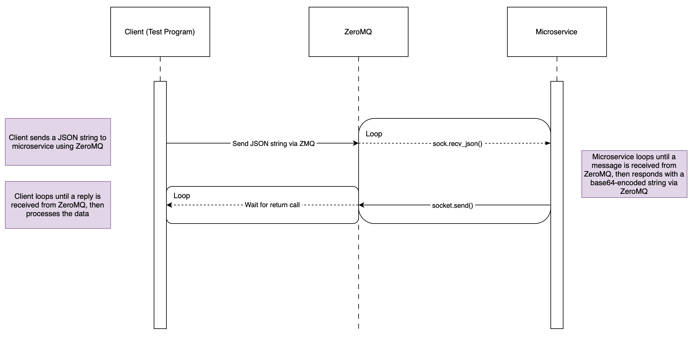

# CS361_Microservice_A

### <ins>Setting-up the communication pipe:</ins>

* microservice.py communicates with clients using ZeroMQ and ("tcp://localhost:5555")

* The microservice expects incoming requests to be a formatted JSON string:
####
    sample_json_string = '''{
    "labels": {
        "title": "Math Progress",
        "x-axis": "Date",
        "y-axis": "DCPM"
    },
    "x-axis-data": [
        "10/1",
        "10/8",
        "10/15"
    ],
    "y-axis-data": [
        "13",
        "16",
        "15"
    ]
    }'''

#### <ins>Import these modules into Python:</ins>
    import zmq                          # for ZeroMQ library.
    import io                           # To store files into an image buffer.
    import base64                       # To decode base64 text.
    from PIL import Image               # To view images.
 
#### <ins>Sending data to the microservice:</ins>
    socket.send_json(sample_json_string)                # Using zmq library.

#### <ins>Receiving data from the microservice:</ins>
    message = socket.recv()                             # Using zmq library.

#### <ins>Received data must be decoded and converted into a byte array:</ins>

    byte_array = bytearray(base64.b64decode(message))   # Using base64 library.

#### <ins>Move byte array into memory buffer variable so that PIL can access:</ins></ins>
    image_buffer = io.BytesIO(byte_array)               # Using io library.

#### <ins>Display image using PIL </ins></ins>
    image = Image.open(image_buffer)                    # Using PIL library.
    image.show()              

